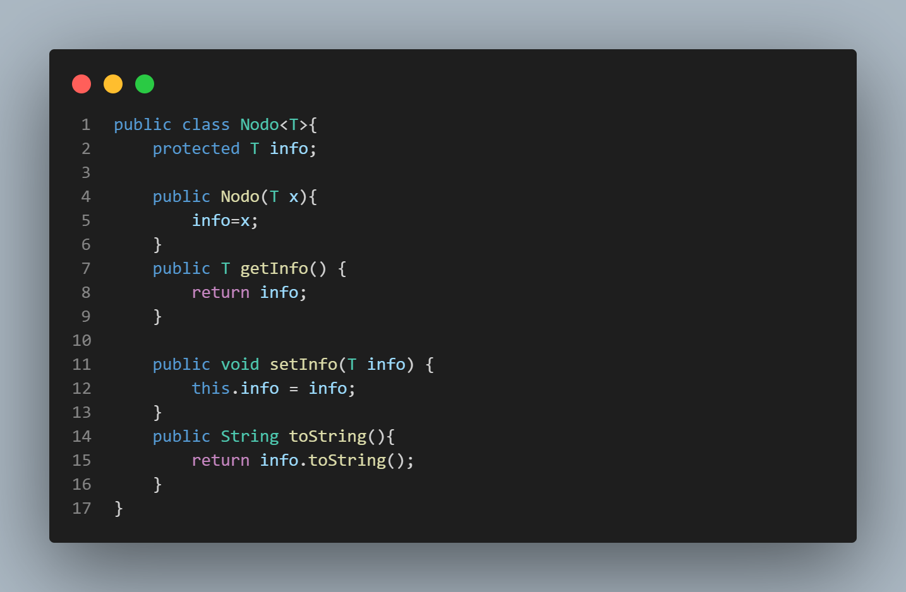
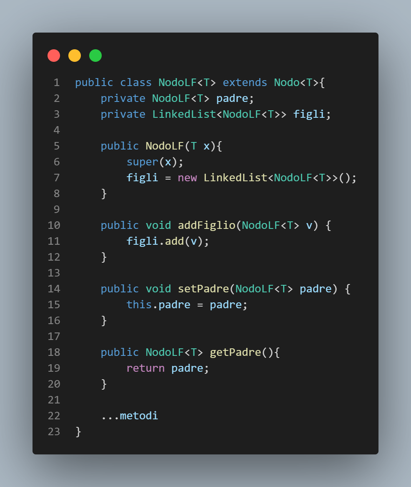
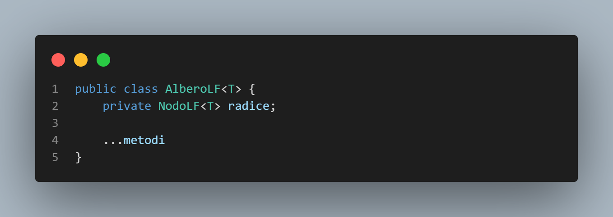
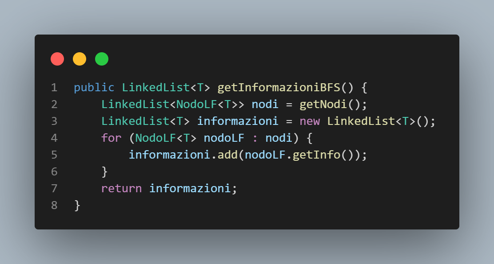
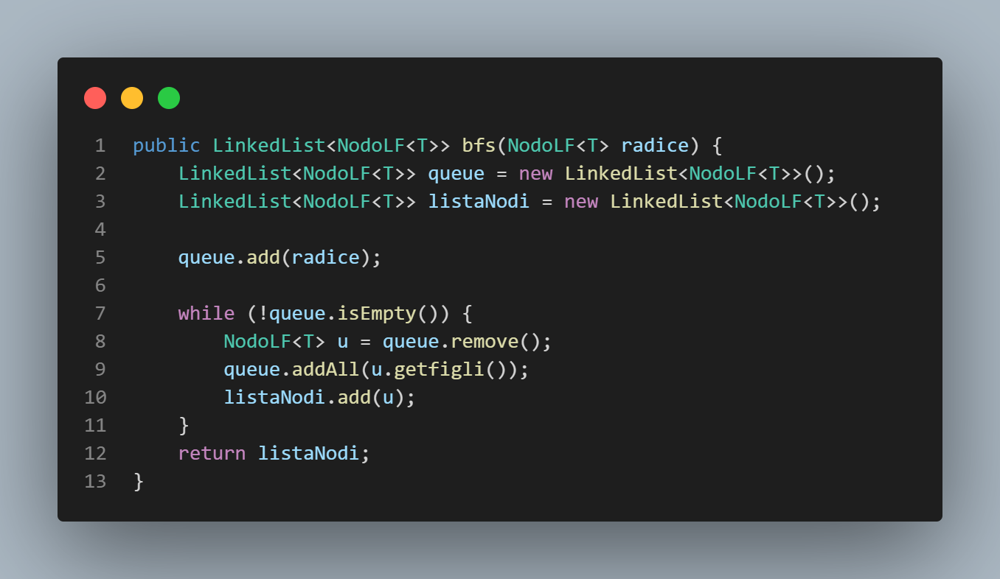
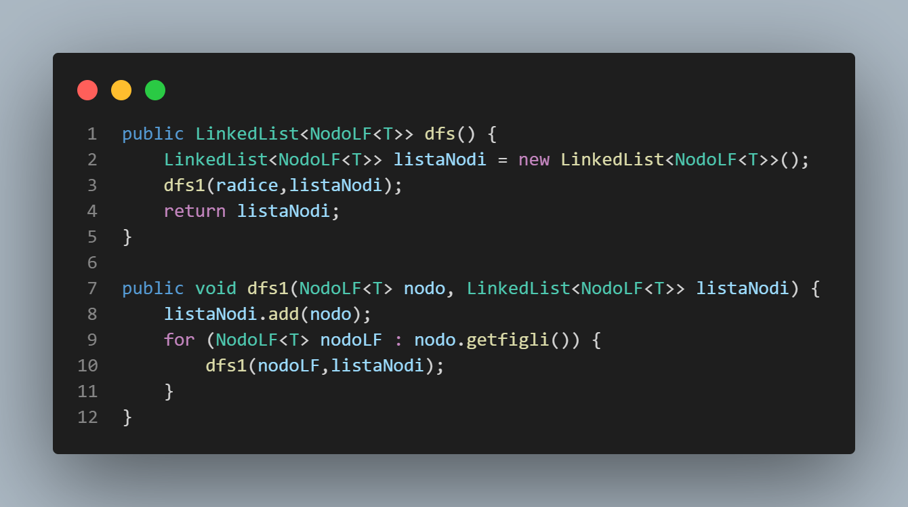
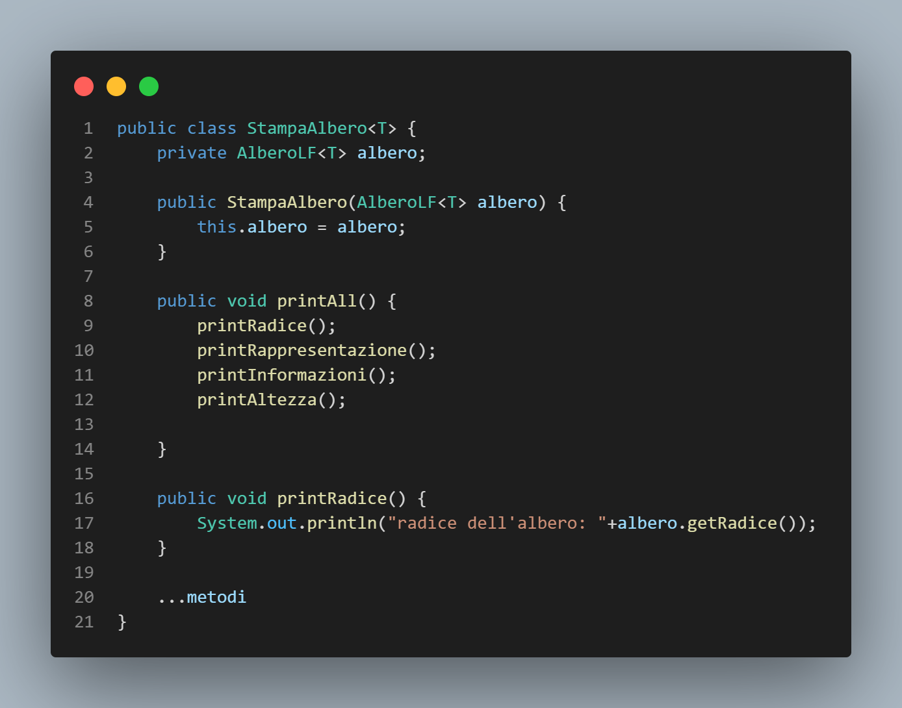
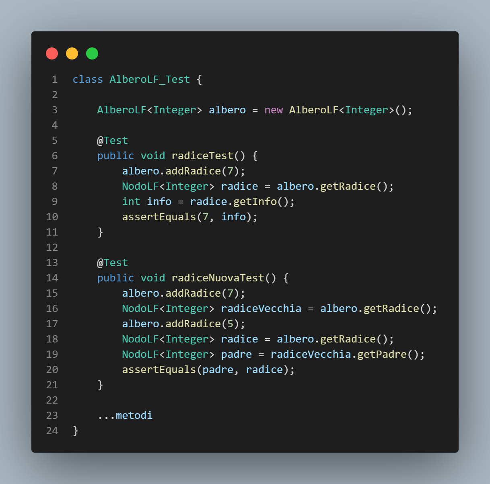

# AlberoLF
**AlberoLF** è un albero con le seguenti caratteristiche: 

1. ogni nodo contiene una sola informazione di cui non sappiamo il tipo e
tutte le informazioni contenute nei nodi sono dello stesso tipo;
2. non è noto il numero massimo di figli che ogni nodo può avere;
3. l’inserimento di un nodo nell’albero (esclusa la radice) è possibile solo
specificando il padre del nodo che verrà inserito e l’informazione che esso
conterrà;
4. quando si inserisce un nodo "v" come figlio di un altro nodo "u" già presente
nell’albero, il nodo "v" diviene l’ultimo figlio di "u".

# NodoLF

La classe è un'astrazione del nodo di un albero, dove ogni nodo ha una informazione e i suoi metodi Getter e Setter.

La classe **NodoLF** è filgia della classe Nodo e viene utilizzata per aggiungere i suoi metodi.

La classe **AlberoLF** è l'amministratrice di tutti nodiLF.

Il metodo **getInformazioniBFS** restituisce la lista delle informazioni dei nodi dell’albero dopo la visita in ampiezza. Prende i nodi con il metodo BFS e memorizza la lista delle informazioni.

Il metodo **getInformazioniDFS** si comporta allo stesso modo del metodo precedente ma utlizzando la visita in profondità(DFS).

## Visita in ampiezza

## Visita in profondità

# Stampa

**StampaAlberoLF** stampa tutte la informazioni richieste dell'albero. 

# Test

La classe AlberoLF_Test è composta dai test per controllare il giusto funzionamento della classe AlberoLF.
